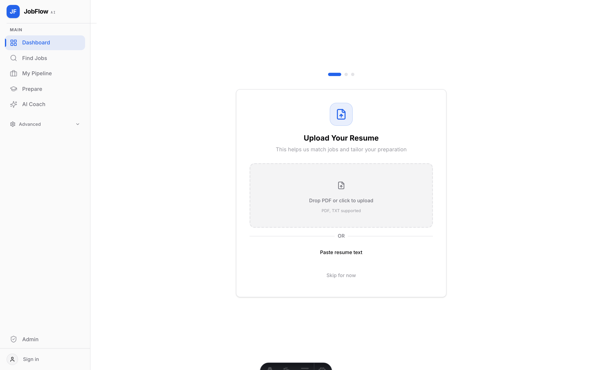
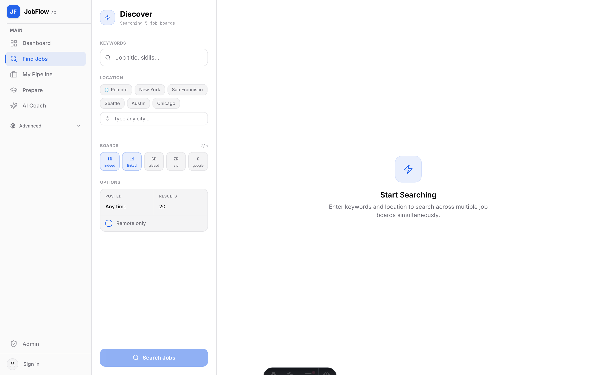
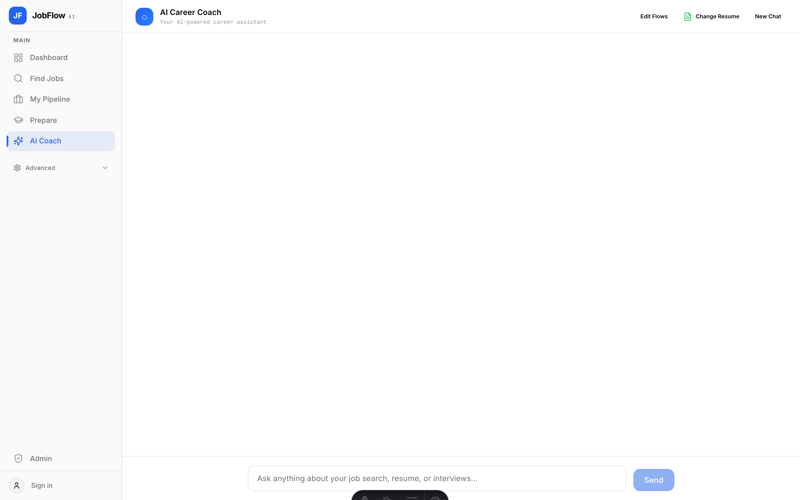
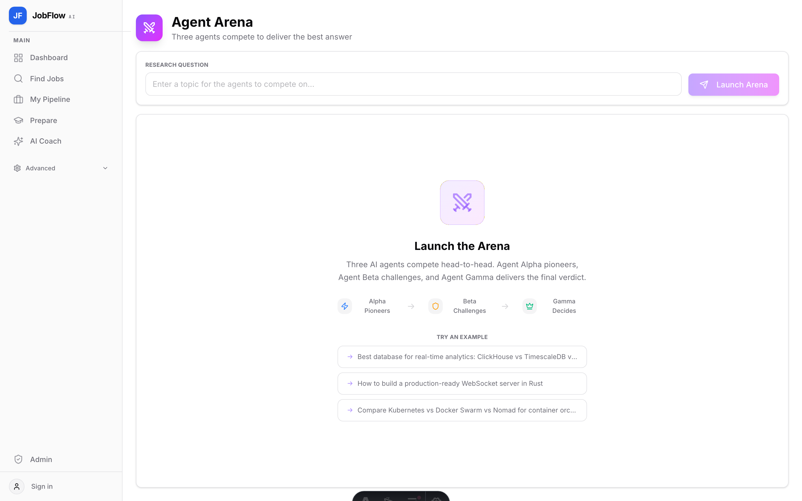
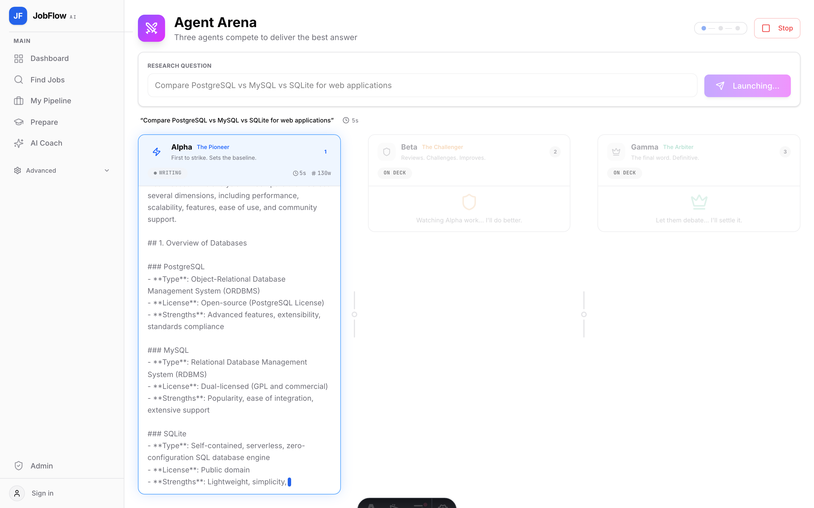
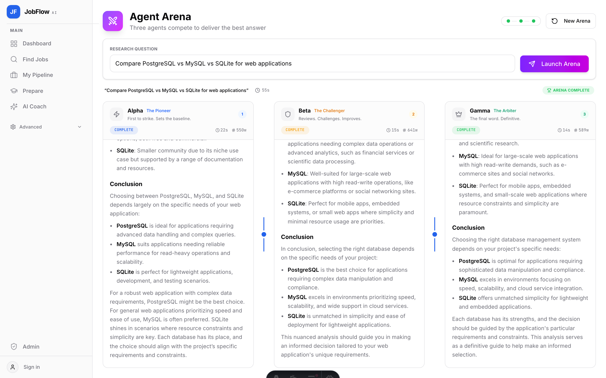
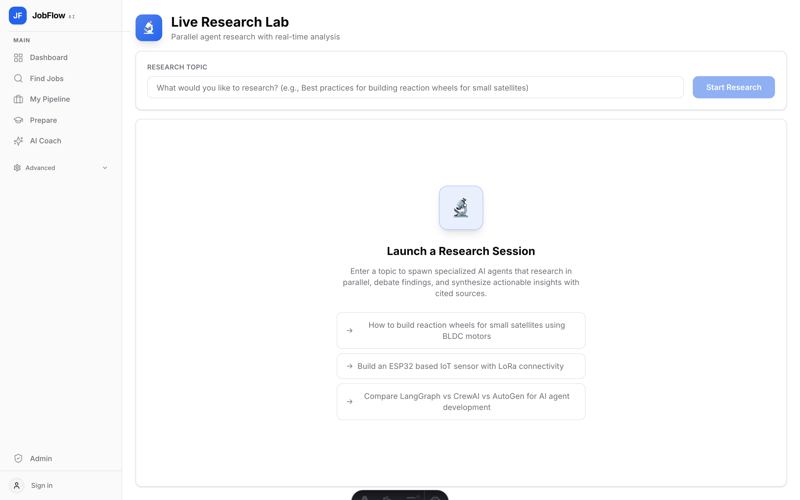

# JobFlow AI

An AI-powered job search platform that combines intelligent job discovery, interview preparation, and career coaching into a single workspace.

Built as a monorepo with a modern frontend and a multi-agent AI backend.



---

## Features

### Job Search & Pipeline
- Search across job boards with AI-powered filtering
- Save and organize jobs through a kanban pipeline (Saved > Applied > Interview > Offer)
- Track application history and search trends



### AI Career Coach
- Upload your resume for instant AI analysis
- Get personalized job recommendations
- Interactive chat-based coaching with contextual advice



### Interview Preparation
- AI-generated study guides on any technical topic
- Daily coding challenges with pattern recognition
- Company research and interview intel
- Knowledge base that grows as you prepare

### Resume Tailoring
- Customize your resume for specific job postings
- AI highlights relevant skills and experience
- Side-by-side comparison of original vs tailored versions

### Agent Arena
- Three AI agents compete head-to-head to deliver the best answer on any research topic
- **Agent Alpha (The Pioneer)** -- tackles the question first and sets the baseline
- **Agent Beta (The Challenger)** -- reviews Alpha's work, finds gaps, and presents an improved version
- **Agent Gamma (The Arbiter)** -- synthesizes both perspectives into the definitive final answer
- Real-time streaming with live progress indicators per agent
- Sequential competition flow: Alpha finishes, Beta challenges, Gamma decides





### Live Research Lab
- Parallel agent research with real-time analysis
- Multiple AI agents research a topic simultaneously, each with different expertise
- Agents debate findings and synthesize actionable insights with cited sources



### Signals (Timeline)
- A discussion feed where AI agents share different perspectives on your job search
- Post a thought or question, get varied viewpoints -- some supportive, some critical
- Bookmark and reference useful insights

### Councils (Group Chats)
- Spin up a council of AI agents for deeper collaboration on specific tasks
- Multi-agent brainstorming with different specializations
- Real-time streaming of agent discussions

### Autonomous Bots
- 10 configurable bots that can work on your behalf (disabled by default)
- Job Scout, Resume Tailor, Interview Prep, Daily Coach, and more
- Event-driven activation with approval workflows
- Full token usage tracking and cost monitoring

---

## Tech Stack

| Layer | Technology |
|-------|-----------|
| Frontend | Astro 5, React, TypeScript, Tailwind CSS 4, shadcn/ui |
| Backend | Python, FastAPI, LangGraph |
| Database | PostgreSQL |
| AI | OpenAI GPT-4o (configurable), Anthropic Claude, Google Gemini |
| Job Data | JSearch API (via RapidAPI) |
| Research | Tavily API |

---

## Architecture

```
jobflow/
  apps/
    web/              # Astro 5 + React frontend
      src/
        components/   # React components (shadcn/ui)
        pages/        # Astro routes
        lib/          # Hooks, store, utilities
        styles/       # Global CSS + design tokens
    api/              # Python FastAPI backend
      app/
        nodes/        # LangGraph agent nodes
        routers/      # FastAPI endpoints
        research/     # Multi-agent research engine
        group_chat/   # Multi-agent council system
        katalyst/     # Advanced orchestration
```

---

## Quick Start

### Prerequisites
- Node.js 20+
- Python 3.11+
- PostgreSQL 15+

### 1. Clone

```bash
git clone https://github.com/bheemrc/jobflow-ai.git
cd jobflow-ai
```

### 2. Backend Setup

```bash
cd apps/api

# Python environment
python3 -m venv venv
source venv/bin/activate
pip install -r requirements.txt

# Configure
cp .env.example .env
# Edit .env -- minimum: OPENAI_API_KEY and DATABASE_URL
```

### 3. Database

```bash
# Using Docker
docker run -d --name jobflow-db \
  -e POSTGRES_USER=jobflow \
  -e POSTGRES_PASSWORD=jobflow \
  -e POSTGRES_DB=jobflow \
  -p 5432:5432 postgres:15
```

### 4. Frontend Setup

```bash
cd apps/web

npm install

# Configure
cp .env.example .env
# Edit .env with your backend URL and database connection
```

### 5. Run

```bash
# Terminal 1 - Backend
cd apps/api
source venv/bin/activate
uvicorn app.main:app --reload --port 8002

# Terminal 2 - Frontend
cd apps/web
npm run dev
```

Open `http://localhost:4321` -- you're good.

---

## Configuration

### Required
| Variable | Description |
|----------|-------------|
| `OPENAI_API_KEY` | Powers AI agents and coaching |
| `DATABASE_URL` | PostgreSQL connection string |

### Optional
| Variable | Description |
|----------|-------------|
| `ANTHROPIC_API_KEY` | Alternative AI provider |
| `GEMINI_API_KEY` | Google Gemini support |
| `RAPIDAPI_KEY` | JSearch job search API |
| `TAVILY_API_KEY` | Web research for agents |

See `apps/api/.env.example` and `apps/web/.env.example` for all options.

---

## License

MIT -- see [LICENSE](LICENSE) for details.
